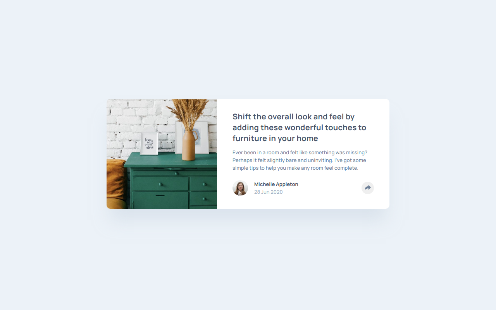

# Frontend Mentor - Article preview component solution

This is a solution to the [Article preview component challenge on Frontend Mentor](https://www.frontendmentor.io/challenges/article-preview-component-dYBN_pYFT). Frontend Mentor challenges help you improve your coding skills by building realistic projects. 

## Table of contents

- [Overview](#overview)
  - [The challenge](#the-challenge)
  - [Screenshot](#screenshot)
  - [Links](#links)
- [My process](#my-process)
  - [Built with](#built-with)
  - [What I learned](#what-i-learned)
  - [Continued development](#continued-development)
  - [Useful resources](#useful-resources)
- [Author](#author)

## Overview

### The challenge

Users should be able to:

- View the optimal layout for the component depending on their device's screen size
- See the social media share links when they click the share icon

### Screenshot

### Links

- Solution URL: [https://www.frontendmentor.io/solutions/article-preview-component-using-react-L6If4QtGYk](https://www.frontendmentor.io/solutions/article-preview-component-using-react-L6If4QtGYk)
- Live Site URL: [https://article-preview-component-xi-nine.vercel.app/](https://article-preview-component-xi-nine.vercel.app/)

## My process

### Built with

- Semantic HTML5 markup
- SCSS
- Flexbox
- [React](https://reactjs.org/) - JS library

### What I learned

Cropping images with object fit and about the time HTML tag.

### Continued development

I need to do more React projects.

### Useful resources

- [How To Scale and Crop Images with CSS object-fit](https://www.digitalocean.com/community/tutorials/css-cropping-images-object-fit) - Great guide to manage images with size constrains.
- [The Time element](https://developer.mozilla.org/en-US/docs/Web/HTML/Element/time) - Easy to read docs about the tag.

## Author

- Frontend Mentor - [@miguelzaga](https://www.frontendmentor.io/profile/miguelzaga)

